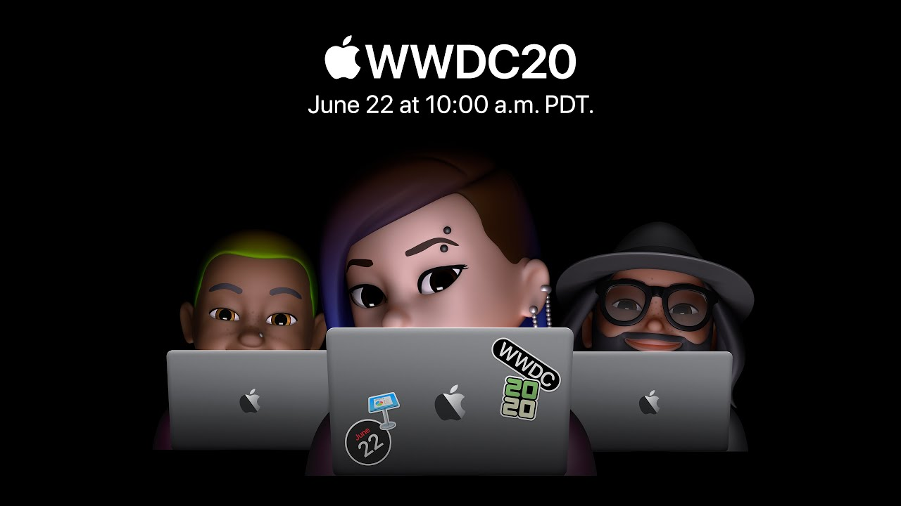

# WWDC 2020 - Web

## 목차

- [Safari](./docs/safari.md)
- [Web APIs](./docs/web-api.md)

## 참고 영상

> WWDC 2020

- [What's new for web developers](https://developer.apple.com/wwdc20/10663)
- [Meet Face ID and Touch ID for the web](https://developer.apple.com/wwdc20/10670)
- [Meet Safari Web Extensions](https://developer.apple.com/wwdc20/10665)

## 지원

오타나 잘못된 내용이 작성되어있는 경우 [여기](https://github.com/leegeunhyeok/wwdc2020-webtech/issues)에 이슈 남겨주세요.

물론, 놓친 부분이나 빠진 내용이 있는 경우에도 해당됩니다.
