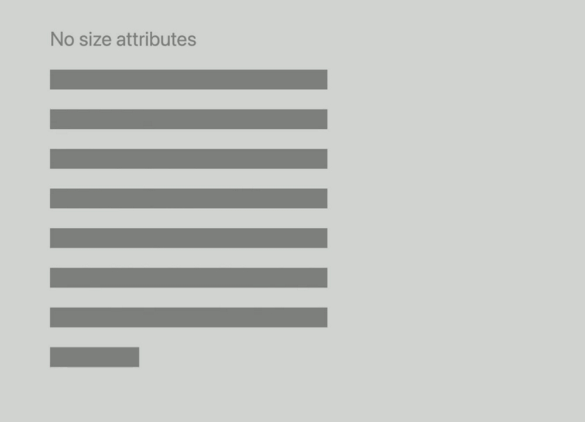

<div align="center">


# Safari 브라우저 업데이트 사항

</div>

## 성능 개선

> Safari 14 버전부터 적용

Chrome 브라우저(2020.06 기준)보다 50% 더 빨라졌다고 함

### 브라우징 환경
- 방문하지 않았던 링크 클릭 시 이전보다 약 **13%** 빨라짐
- 방문했던 링크 클릭 시 이전보다 약 **42%** 빨라짐
- 이전에 방문했던 웹 주소 검색/입력 시 약 **52%** 빨라짐
- 이전보다 **34%** 더 많은 웹사이트를 캐싱하여 빠른 로드 가능
- PDF 다운로드 중 첫 페이지 **60x** 더 빠르게 렌더링
- 응답하지 않는 탭 **50ms** 만에 닫을 수 있음 


### 개발자
- 스크롤 시 CPU 자원 사용량 **1/3**로 감소
- `IndexedDB` **최대 10배** 빨라짐
- `for-of` **최대 15배** 빨라짐
- `Promise` **2배** 빨라짐
- `delete` 연산 **12배** 빨라짐


## HTML

### enterkeyhint 속성 추가
`textarea`, `contenteditable` 요소에서 사용할 수 있는 속성 추가

```html
<div id="editor" contenteditable="true" enterkeyhint="send"></div>
```


## CSS

### 시스템 기본 폰트 추가
```css
html {
  font-family: system-ui;
  font-family: ui-sans-serif; /* San Francisco */
  font-family: ui-serif; /* New York */
  font-family: ui-monospace; /* SF Mono */
  font-family: ui-rounded; /* SF Rounded */
}
```


### line-break: anywhere 추가
- 참고 문서
  - [MDN - line-break](https://developer.mozilla.org/en-US/docs/Web/CSS/line-break)

```css
.text {
  line-break: anywhere;
}
```


### :is() 가상 선택자 추가
반복적인 선택자 사용을 방지하며, 선택자 목록의 대상을 확인함

- 지원 범위: `>= Safari 14`
- 참고 문서
  - [MDN - :is()](https://developer.mozilla.org/en-US/docs/Web/CSS/:is)

```css
h1, h2, h3, h4, h5, h6 {
  margin-top: 3em;
}

/* Before */
h1 + h2, h1 + h3, h1 + h4, h1 + h5, h1 + h6,
h2 + h3, h2 + h3, h2 + h4, h2 + h5, h2 + h6,
h3 + h4, h3 + h3, h3 + h4, h3 + h5, h3 + h6,
h4 + h5, h4 + h3, h4 + h4, h4 + h5, h4 + h6,
h5 + h6, h5 + h3, h5 + h4, h5 + h5, h5 + h6 {
  margin-top: 0;
}

/* After */
:is(h1, h2, h3, h4, h5, h6) + :is(h1, h2, h3, h4, h5, h6) {
  margin-top: 0;
}
```


### :where() 가상 선택자 추가
`:is()`와 동일하게 동작하지만, 가장 낮은 명시도(specificity)인 0을 가지므로 오버라이딩 됨

- 지원 범위: `>= Safari 14`
- 참고 문서
  - [MDN - :where()](https://developer.mozilla.org/en-US/docs/Web/CSS/:where)

```css
/* Before */
:is(.is-intro, .is-pullquote, #is-hero) + p {
  text-transform: uppercase;
}

/* After */
:where(.where-intro, .where-pullquote, #where-hero) + p {
  text-transform: uppercase;
}

h2 + p,
h3 + p,
h4 + p,
h5 + p,
h6 + p {
  text-transform: none; /* where-* 클래스가 적용된 요소는 none이 적용됨 */
}
```


### ::part() 가상 선택자 추가
섀도우 돔 요소의 part 속성과 일치하는 요소를 나타냄

- 지원 범위: `>= Safari 13.1`
- 참고 문서
  - [MDN - Web Components](https://developer.mozilla.org/en-US/docs/Web/Web_Components)
  - [MDN - Using shadow DOM](https://developer.mozilla.org/en-US/docs/Web/Web_Components/Using_shadow_DOM)
  - [MDN - ::part()](https://developer.mozilla.org/en-US/docs/Web/CSS/::part)

```html
<template id="format-button">
  <button class="format">
    <span part="icon" class="icon"></span>
    <span part="label" class="label"></span>
  </button>
</template>

<style>
#bold::part(icon) {
  color: var(--formatting-button-icon-color);
  font-weight: bold;
}

#italic::part(icon) {
  color: var(--formatting-button-icon-color);
  font-style: italic;
}

#underline::part(icon) {
  color: var(--formatting-button-icon-color);
  text-decoration: underline;
}
</style>
```

## Media

### WebP 이미지 지원
- PNG와 같이 무손실 압축 포맷, 투명 지원
- 애니메이션 지원
- 더 작은 파일 크기

```html
<picture>
  <source srcset="example.webp" type="image/webp">
  
</picture>

Accept: image/webp,image/png,image/svg+xml,image/*;…
```


### 기본 이미지 비율 설정
이미지 요소의 폭(width), 높이(height) 속성 값으로 기본 이미지 비율을 설정할 수 있음

- Without width/height

```html

```


- With width/height

```html

```


### CSS image-orientation 속성 추가
이미지를 회전하는 속성이며, 기본적으론 이미지에 포함된 EXIF 정보를 기준으로 적절히 회전하여 보여줌

- 지원 범위: `>= Safari 13.1`
- 참고 문서
  - [MDN - image-orientation](https://developer.mozilla.org/en-US/docs/Web/CSS/image-orientation)


### macOS HDR 디스플레이 지원

HDR(High Dynamic Range) 디스플레이를 위한 미디어 지원(영상)과 미디어 쿼리 지원

```html
<style>
@media only screen (dynamic-range: high) {
  /* HDR-only CSS rules */
}
</style>

<script>
if (window.matchMedia("dynamic-range: high")) {
  // HDR-specific JavaScript
}
</script>
```

### Remote Playback API
웹 상의 동영상 플레이어 에어플레이 지원함, 서로 다른 기기에서의 원격 재생 지원

자세한 내용은 [여기](./web-api.md#remote-playback-api) 참고


### PIP API
macOS 11, iPadOS 14, iOS 14에 추가된 PIP(Picture In Picture) 기능을 위한 API 추가

자세한 내용은 [여기](./web-api.md#pip-api) 참고


### Timed 메타데이터 지원

도움 필요 / #EXT-X-DATERANGE, DataCue, emsg

- 참고 문서
  - [HLS](https://developer.apple.com/streaming)


### 자막 기능 개선

- TextTrackCue를 통해 네이티브 렌더링
- 자막 포맷 사용
- 사용자의 접근성 존중
- 전체화면 및 PIP 지원
